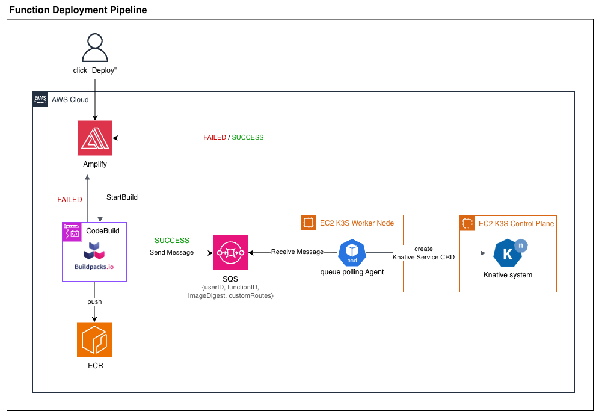

# CodeBuild Repo README

<details open>
<summary>🇰🇷 한국어</summary>

## 📜 개요



이 리포지토리는 cutty-x FaaS 플랫폼의 **빌드 엔진 역할을 하는 AWS CodeBuild 구성 요소**입니다. 
<br>
사용자가 작성한 코드를 S3에서 가져와 Cloud Native Buildpacks를 통해 컨테이너 이미지로 변환하고, 이를 ECR에 배포한 후 결과(성공/실패)를 시스템에 전파하는 전체 파이프라인을 정의합니다.
<br>
유지보수성과 확장성을 위해 스크립트가 단계별로 모듈화되어 있습니다.

<br>

---


## 📂 디렉터리 구조
빌드 스크립트는 실행 단계와 목적에 따라 체계적으로 분리되어 있습니다.
```
.
├── buildspec.yml                   # AWS CodeBuild 빌드 명세서
└── scripts
    ├── 01_prebuild/
    │   ├── install_pack.sh         # pack CLI 설치
    │   ├── resolve_env.sh          # 빌드 환경 변수 검증 및 설정
    │   ├── s3_sync_and_validate.sh # S3 소스 코드 다운로드 및 검증
    │   ├── patch_package_json.sh   # package.json 의존성/스크립트 주입
    │   └── process_env_files.sh    # 사용자 환경변수(.env) 생성 및 래핑
    ├── 02_build/
    │   └── build_image.sh          # pack build 실행 및 ECR 푸시
    ├── 03_postbuild/
    │   └── publish_sqs_message.sh  # SQS로 성공 메시지 전송
    ├── lib/
    │   ├── create_env_file.py      # .env 파일 생성
    │   ├── create_env_wrapper.py   # dotenv 로드를 위한 엔트리포인트 래퍼 생성
    │   ├── parse_custom_env.py     # CLI/Shell용 환경변수 문자열 파싱
    │   └── patch_package_json.py   # FaaS 의존성 추가 및 start 스크립트 주입
    └── common.sh                   # 공통 함수 (에러 핸들링, 환경변수 로드)
```

<br>

---

## ⚙️ 빌드 프로세스
`buildspec.yml`에 정의된 4단계의 라이프사이클을 통해 빌드가 진행됩니다.

### 1. Install Phase
- `install_pack.sh`: Cloud Native Buildpacks를 사용하기 위한 핵심 도구인 pack CLI를 설치합니다.
- 캐싱(Caching): 빌드 속도 최적화를 위해 pack 바이너리와 Docker 레이어를 로컬 캐시에 저장하여 재사용합니다.

### 2. Pre_build Phase
본격적인 빌드 전, 코드를 준비하고 환경을 구성합니다.
- `resolve_env.sh`: 필수 환경 변수가 올바르게 설정되었는지 확인하고 로드합니다.
- `s3_sync_and_validate.sh`: 사용자의 소스 코드를 S3에서 다운로드하고 파일 무결성을 검증합니다.
- `patch_package_json.sh`: `lib/patch_package_json.py`를 호출하여 FaaS 구동에 필요한 의존성(@google-cloud/functions-framework)과 실행 스크립트를 주입합니다.
- `process_env_files.sh`: `lib/create_env_file.py` 등을 호출하여 사용자가 설정한 환경 변수(CUSTOM_ENV)를 .env 파일로 변환하고, 이를 런타임에 로드할 수 있도록 엔트리포인트를 래핑합니다.

### 3. Build Phase
- `build_image.sh`: 준비된 소스 코드를 pack build 명령어를 통해 OCI 호환 컨테이너 이미지로 빌드합니다. 빌드가 완료되면 이미지를 Amazon ECR로 푸시합니다.

### 4. Post_build Phase
- `publish_sqs_message.sh`: 빌드 및 푸시가 성공하면, 배포 완료 트리거를 위해 이미지 다이제스트 등의 정보를 담은 메시지를 SQS로 전송합니다.
- 실패 알림: `common.sh`에 정의된 `notify_deploy_failed` 함수를 통해 단계별 오류 발생 시 즉시 실패 상태를 전파합니다.
<br>

---

## 🐍 Python 유틸리티 스크립트 (`scripts/lib/`)
복잡한 파일 조작 로직은 파이썬 스크립트로 분리하여 관리합니다.
- `scripts/lib/patch_package_json.py`: `package.json` 파일에 `@google-cloud/functions-framework` 와 `dotenv` 의존성을 추가하고, `start` 스크립트를 설정하여 Cloud Functions Framework를 통해 함수를 실행할 수 있도록 보장합니다.
- `scripts/lib/create_env_file.py`: `CUSTOM_ENV` 환경 변수로부터 `.env` 파일을 생성합니다.
- `scripts/lib/create_env_wrapper.py`: `dotenv`를 사용하여 `.env` 파일을 로드하는 `index.js` 래퍼를 생성합니다.
- `scripts/lib/parse_custom_env.py`: (현재 `buildspec.yml`에서 사용되지 않음) `CUSTOM_ENV` 변수를 파싱하여 `pack build` 명령어에 `--env` 플래그로 전달하는 대안적인 방법을 제공합니다.
<br>

---

## ⚡ 캐시 설정
빌드 성능 향상을 위해 `buildspec.yml`에 다음과 같은 로컬 캐시가 적용되어 있습니다.
- Source Cache: git 소스 및 다운로드된 파일 캐싱
- Docker Layer Cache: 이전에 빌드된 도커 레이어 재사용
- Custom Cache: pack CLI 및 관련 볼륨 데이터 캐싱 (`/usr/local/bin/pack`, `/var/lib/docker/volumes`)

</details>

<details>
<summary>🇯🇵 日本語</summary>

## 📜 概要

このリポジトリは、cutty-x FaaS プラットフォームの ビルドエンジンとして動作する AWS CodeBuild 構成 を提供します。
<br>
ユーザーが作成したコードを S3 から取得し、Cloud Native Buildpacks を使用してコンテナイメージへ変換し、ECR にプッシュした後、その結果（成功 / 失敗）をシステム全体に伝達するためのビルドパイプラインを定義しています。
<br>
また、保守性と拡張性を高めるために、ビルド処理をフェーズごとにモジュール化しています。

## 📂 ディレクトリ構造
ビルドスクリプトは、フェーズと目的に応じて整理されています。
```
.
├── buildspec.yml                   # AWS CodeBuild ビルド仕様
└── scripts
    ├── 01_prebuild/
    │   ├── install_pack.sh         # pack CLI のインストール
    │   ├── resolve_env.sh          # 必須環境変数の検証およびロード
    │   ├── s3_sync_and_validate.sh # S3 ソースコードのダウンロードと検証
    │   ├── patch_package_json.sh   # package.json の依存関係/スクリプト注入
    │   └── process_env_files.sh    # 環境変数(.env) の生成およびラッピング
    ├── 02_build/
    │   └── build_image.sh          # pack build と ECR プッシュ
    ├── 03_postbuild/
    │   └── publish_sqs_message.sh  # SQS への成功メッセージ送信
    ├── lib/
    │   ├── create_env_file.py      # .env ファイル生成
    │   ├── create_env_wrapper.py   # dotenv ローダーのエントリーポイント生成
    │   ├── parse_custom_env.py     # 環境変数文字列の解析
    │   └── patch_package_json.py   # FaaS 依存関係と start スクリプトを注入
    └── common.sh                   # 共通関数（エラーハンドリングなど）
```


## ⚙️ ビルドプロセス
`buildspec.yml`で定義された 4 つのフェーズに従ってビルドが実行されます。
### 1. Install Phase
- `install_pack.sh`: Cloud Native Buildpacks を使用するための pack CLI をインストール
- キャッシュ最適化：pack バイナリと Docker レイヤーをローカルキャッシュとして保持し、ビルド速度を向上

### 2. Pre_build Phase
本番ビルドの前にコードと環境を準備します。
- `resolve_env.sh`: 必須環境変数が設定されているかを検証し、ロード
- `s3_sync_and_validate.sh`: S3 からユーザーのソースコードを取得し、ファイル内容を検証
- `patch_package_json.sh`: `lib/patch_package_json.py` を呼び出し、Cloud Functions Framework 用の依存関係と start スクリプトを挿入
- `process_env_files.sh`: `lib/create_env_file.py` を使用して CUSTOM_ENV から .env を生成し、ランタイムでロードされるようエントリーポイントをラップ

### 3. Build Phase
- `build_image.sh`: pack build により OCI 準拠のコンテナイメージを生成し、Amazon ECR にプッシュします。

### 4. Post_build Phase
- `publish_sqs_message.sh`：ビルド成功後、イメージダイジェスト等を含むメッセージを SQS に送信し次のデプロイフェーズをトリガー
- 失敗通知：各フェーズでエラーが発生した場合、`common.sh` の `notify_deploy_failed` により即時失敗を通知

## 🐍 Python ユーティリティスクリプト（`scripts/lib/`）
複雑なファイル操作ロジックは Python スクリプトに分離されています。
- `patch_package_json.py`：`@google-cloud/functions-framework` と `dotenv` を依存関係に追加し、FaaS 実行用の start スクリプトを挿入
- `create_env_file.py`：CUSTOM_ENV から .env を生成
- `create_env_wrapper.py`：dotenv をロードするエントリーポイントファイルを生成し、ユーザーコードを安全にラップ
- `parse_custom_env.py`：pack build に渡すために環境変数を解析する代替手法（現在未使用）

## ⚡ キャッシュ設定
ビルド性能向上のために以下のローカルキャッシュを利用します。
- Source Cache：ソースおよびダウンロード済みファイルをキャッシュ
- Docker Layer Cache：過去の Docker レイヤーを再利用
- Custom Cache：pack CLI と Docker ボリュームキャッシュ(`/usr/local/bin/pack`, `/var/lib/docker/volumes`)

</details>

<details>
<summary>🇬🇧 English</summary>

## 📜 Overview

This repository provides the **AWS CodeBuild build engine** used in the cutty-x FaaS platform.
<br>
It defines the full build pipeline responsible for fetching user-submitted code from S3, converting it into a container image using Cloud Native Buildpacks, pushing the image to ECR, and propagating the build result (success or failure) to the rest of the system.
<br>
To maximize maintainability and extensibility, each build step is modularized into separate scripts.

## 📂 Directory Structure
```
.
├── buildspec.yml                   # AWS CodeBuild build specification
└── scripts
    ├── 01_prebuild/
    │   ├── install_pack.sh         # Install pack CLI
    │   ├── resolve_env.sh          # Validate and load required build env variables
    │   ├── s3_sync_and_validate.sh # Download and verify user code from S3
    │   ├── patch_package_json.sh   # Inject dependencies/scripts into package.json
    │   └── process_env_files.sh    # Generate and wrap .env files for runtime use
    ├── 02_build/
    │   └── build_image.sh          # Run pack build and push to ECR
    ├── 03_postbuild/
    │   └── publish_sqs_message.sh  # Send success message to SQS
    ├── lib/
    │   ├── create_env_file.py      # Generate .env file
    │   ├── create_env_wrapper.py   # Create entrypoint wrapper that loads dotenv
    │   ├── parse_custom_env.py     # Parse env strings for CLI use
    │   └── patch_package_json.py   # Inject FaaS dependencies and start scripts
    └── common.sh                   # Shared utilities (error handling, env loading)
```

## ⚙️ Build Process
The build proceeds through four lifecycle phases defined in buildspec.yml.
### 1. Install Phase
- `install_pack.sh`: Installs the pack CLI required for Cloud Native Buildpacks.
- Caching: Stores the pack binary and Docker layers locally to accelerate subsequent builds.

### 2. Pre_build Phase
Prepares the environment and user code before building.
- `resolve_env.sh`: Validates required environment variables and loads them
- `s3_sync_and_validate.sh`: Downloads user code from S3 and validates file integrity
- `patch_package_json.sh`: Uses `lib/patch_package_json.py` to inject required dependencies and the start script for the Cloud Functions Framework
- `process_env_files.sh`: Generates a .env file from CUSTOM_ENV and wraps the user entrypoint so the variables load at runtime

### 3. Build Phase
- `build_image.sh`: Builds an OCI-compliant container image using pack build and pushes the image to Amazon ECR.

### 4. Post_build Phase
- `publish_sqs_message.sh`: Sends an SQS message containing image metadata (e.g., digest) to trigger the deployment workflow.
- Failure handling: Any failure during the pipeline immediately triggers notify_deploy_failed defined in common.sh.

## 🐍 Python Utility Scripts (`scripts/lib/`)
Complex file manipulation is delegated to Python utilities.
- `patch_package_json.py`: Adds `@google-cloud/functions-framework` and `dotenv` dependencies and injects the required start script
- `create_env_file.py`: Generates a .env file from the CUSTOM_ENV variable
- `create_env_wrapper.py`: Generates a wrapper entrypoint that loads .env using dotenv
- `parse_custom_env.py`: Alternative (currently unused) method for passing env vars to pack build

## ⚡ Cache Configuration
To improve build performance, the following CodeBuild local caches are used:
- Source Cache: Caches source files and downloaded artifacts
- Docker Layer Cache: Reuses previously created Docker layers
- Custom Cache: Stores the pack CLI binary and Docker volume data (`/usr/local/bin/pack`, `/var/lib/docker/volumes`)
